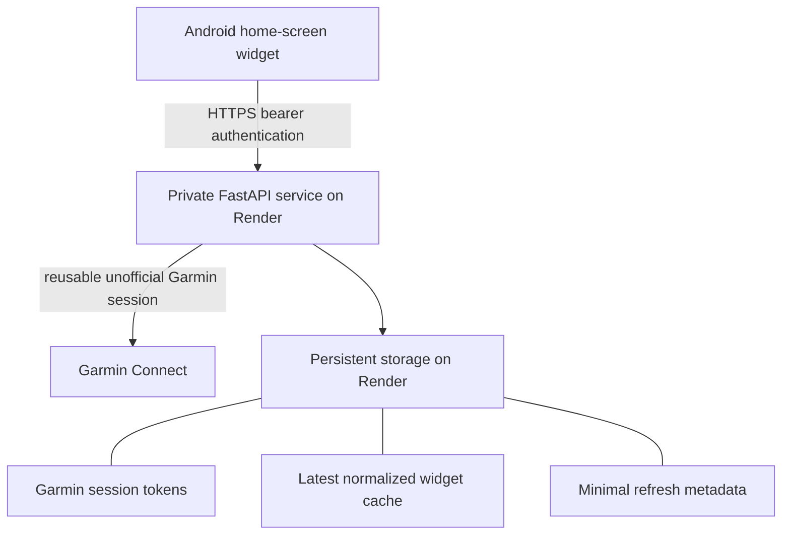
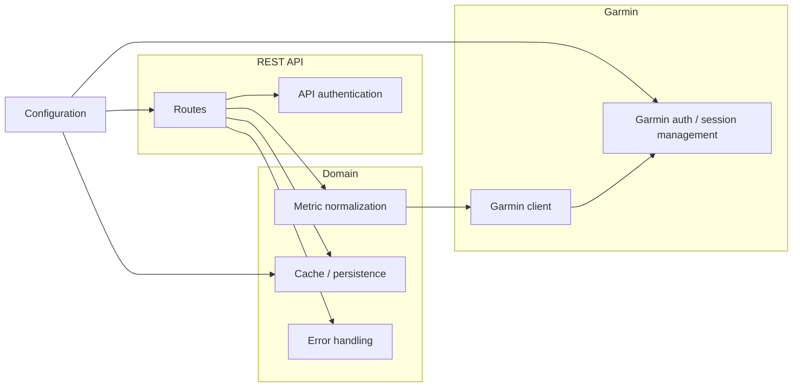
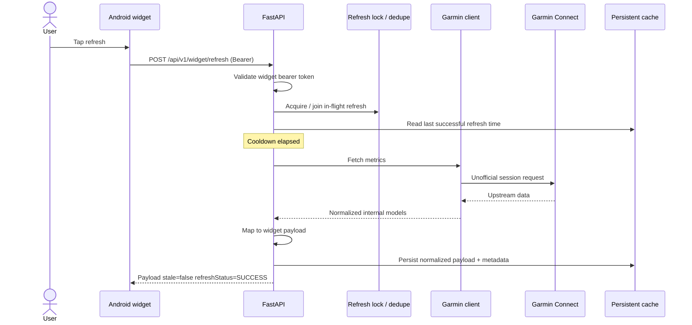
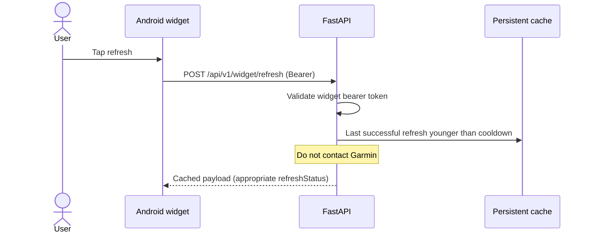
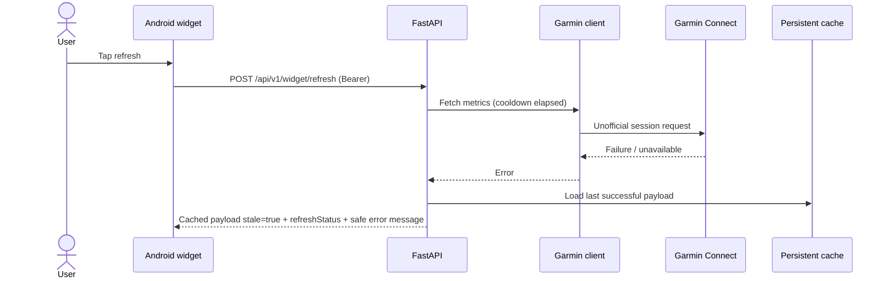
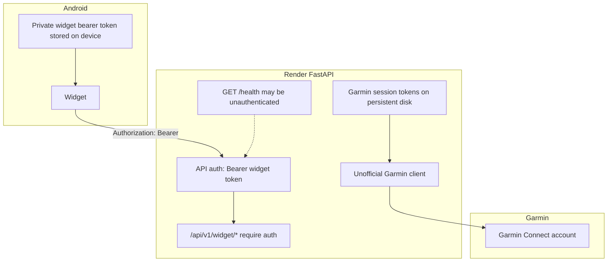
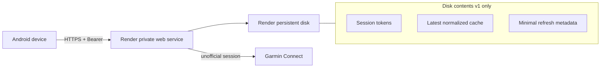

# Architecture

Private personal-use garmin-widget system. Concise diagrams and component boundaries. Spec details live in [PROJECT.md](../PROJECT.md).

**Status:** Backend Phases 1–6 deployed and verified. Phase 7 Android app and widget complete. Phase 8A expanded data contract implemented locally (not yet deployed to Render).

## System architecture

Version one does **not** store long-term health history.

## Backend component boundaries

Rules:

- The **REST API** returns only **normalized** widget payloads (and health status). It must not depend on raw Garmin response structures.
- The **Garmin client** returns normalized internal models; **metric normalization** maps those into the public widget schema.
- **API authentication** (widget bearer token) is separate from **Garmin authentication / session management**.
- **Configuration**, **cache/persistence**, and **error handling** are distinct responsibilities.

## Successful refresh flow

## Cooldown / cache-hit flow

`GET /api/v1/widget/latest` always returns the last successful cache and **never** contacts Garmin. `GET /health` returns service status and **never** contacts Garmin. Widget routes require `Authorization: Bearer <private widget token>`; `/health` does not.

Refresh coordination currently uses a **process-scoped** lock keyed by data directory. Separately constructed services in one process that share `DATA_DIR` still deduplicate refreshes. This does **not** coordinate multiple OS processes or Render instances. Deploy the first Render instance with a single worker and a persistent disk (see [render-deployment.md](render-deployment.md)). Configuration is prepared via root `render.yaml`; live Render/domain setup is not completed by the repository alone.

## Garmin failure fallback flow

Never return Garmin credentials, session tokens, stack traces, or sensitive upstream responses.

## Authentication boundaries

- Widget bearer token ≠ Garmin credentials or Garmin session tokens.
- Clients never receive Garmin session material.

## Deployment layout

## Public endpoints (documented)

| Method | Path | Version one |
|--------|------|-------------|
| `GET` | `/health` | Yes — unauthenticated; no Garmin contact |
| `GET` | `/api/v1/widget/latest` | Yes — bearer auth; cache only |
| `POST` | `/api/v1/widget/refresh` | Yes — bearer auth; cooldown, lock, Garmin, fallback |
| `GET` | `/api/v1/widget/history` | **No** — future only; out of scope for v1 |

## Expanded normalized snapshot (Phase 8A)

The widget snapshot now includes additive nullable premium fields alongside the original metrics. All new fields use `schemaVersion=1` and are backward-compatible:

- **`sleepStages`**: deep/light/REM/awake durations (negative values rejected at extraction).
- **`hrvTrend`**: bounded rolling 7-day window (max 7 entries, oldest-first). Initial backfill fetches up to 6 historical HRV calls; same-day refreshes reuse the cached trend and fetch only the current day.
- **`bodyBatteryTimeline`** / **`stressTimeline`**: intraday sorted/deduped points with values clamped to 0–100 and downsampled to max 48 entries. Duplicate timestamps prefer the last valid sample.
- **`lastActivity`**: most recent activity. `startTimeGMT` is the trusted UTC source and may be parsed from either a naive GMT string or an offset-bearing timestamp. `startTimeLocal` is ignored when GMT is absent, so local-only timestamps are never mislabeled with `Z`. Activities with no recognized public fields return `null`. Optional `heartRateTimeline` (max 48 chronological `{elapsedSeconds, heartRate}` points) is derived from a transient `get_activity_details(..., maxpoly=0)` fetch when a usable activity ID exists; activity IDs, GPS/route polylines, and raw detail channels are never serialized. Without a usable ID, summary activity still succeeds and the timeline is omitted. Call budgets become 16/10 with details, otherwise 15/9.

The snapshot persists the complete expanded payload including trend/timelines/activity, surviving repository reload and service restarts. The activity HR timeline extension is implemented locally for Phase 8B and is **not claimed deployed** until merged and live-verified.

## Operational risk

Unofficial Garmin Connect access may break without notice if Garmin changes private APIs. Treat upstream breakage as expected operational risk for a personal project.
